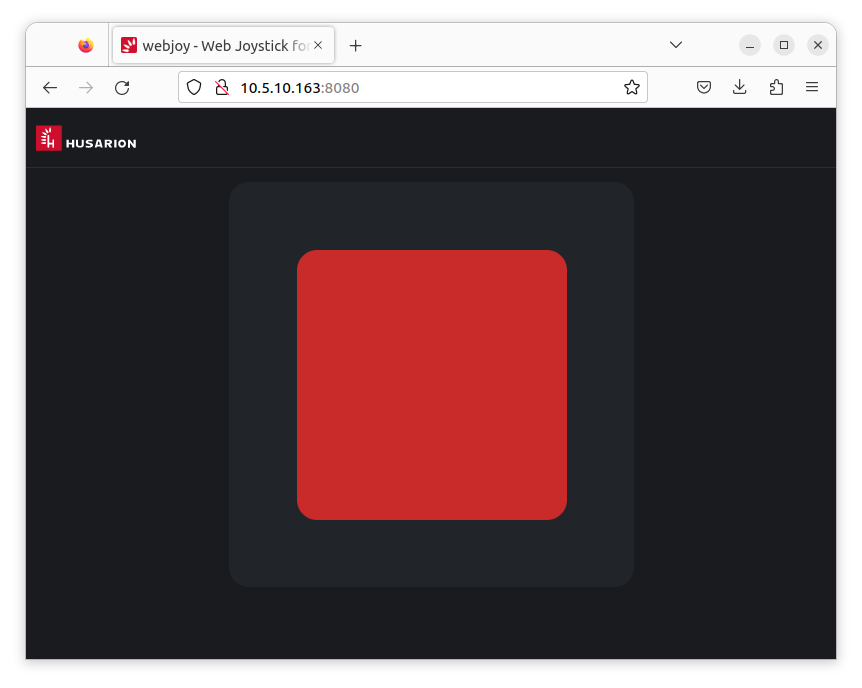

# webjoy

Web-Based Joystick for Steering ROS-Enabled Mobile Robots



## Usage

1. First run the `rosbridge-server` on the ROS 2 powered robot:

```bash
docker run -d \
-p 9090:9090 \
husarion/rosbridge-server:humble \
ros2 launch rosbridge_server rosbridge_websocket_launch.xml
```

2. Launching the `webjoy`:

```bash
docker run -d \
-p 8080:8080 \
husarion/webjoy
```

3. Visit `http://<robot-ip-address>:8080` URL to control the robot.

## Development

1. Run the `compose.rosbot.yaml` on the robot (in this example ROSbot 2R):

```bash
docker compose -f compose.rosbot.yaml pull
docker compose -f compose.rosbot.yaml up
```

2. (on the PC) Prepare `.env` file that stores the IP address of the robot:

```bash
mv template.env .env
# PREACT_APP_ROSBRIDGE_SERVER_HOST=10.5.10.163 # replace "10.5.10.163" with robot's IP
```

3. (on the PC) Launch the development server:

```bash
docker compose -f compose.dev.yaml build
docker compose -f compose.dev.yaml up
```

4. Visit http://localhost:8080 and start working with files from `src/` directory. The changes will be automatically available at http://localhost:8080 .

## Demo

Visit the [demo](demo/) folder to find the usage examples.

## Creating a new release

```bash
git tag v0.2.0 main
git push origin v0.2.0 main
```